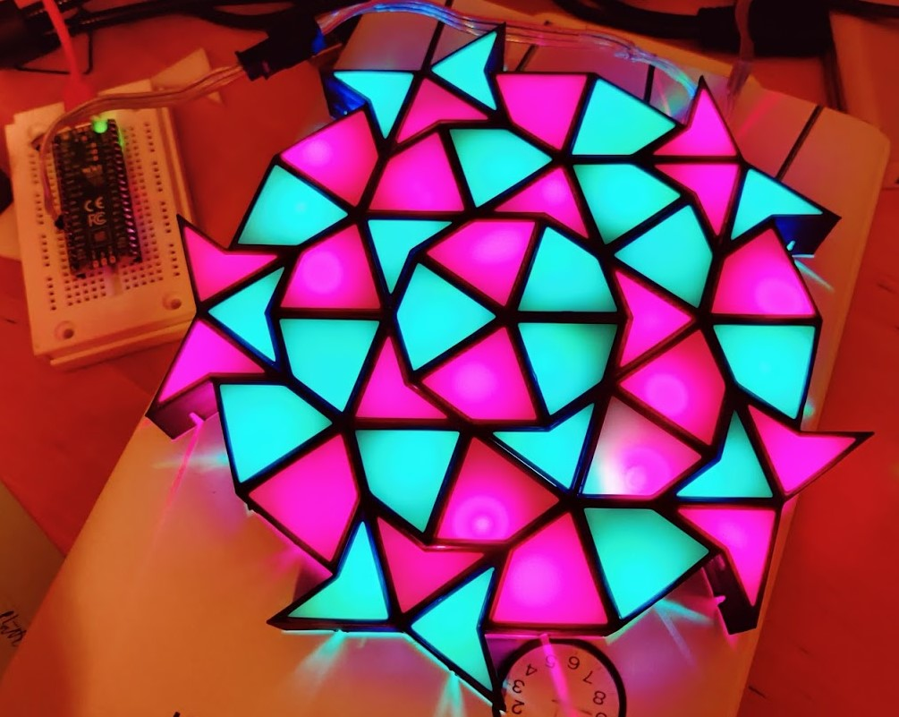
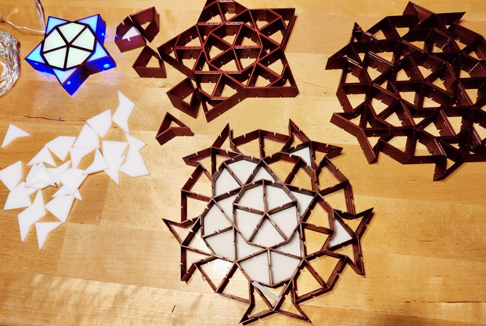
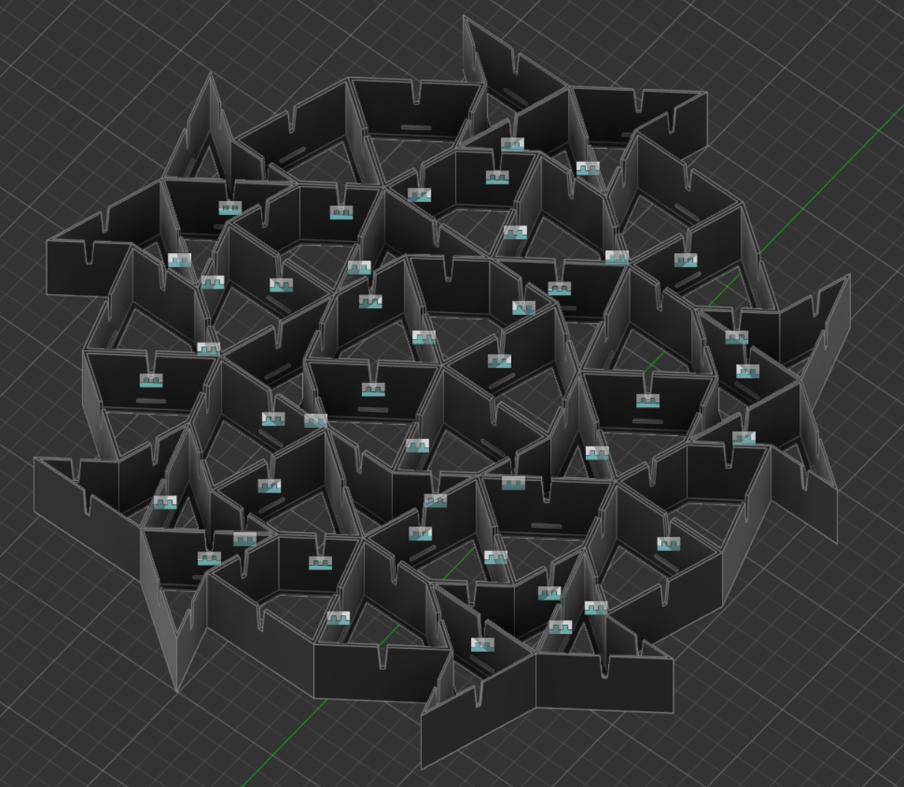
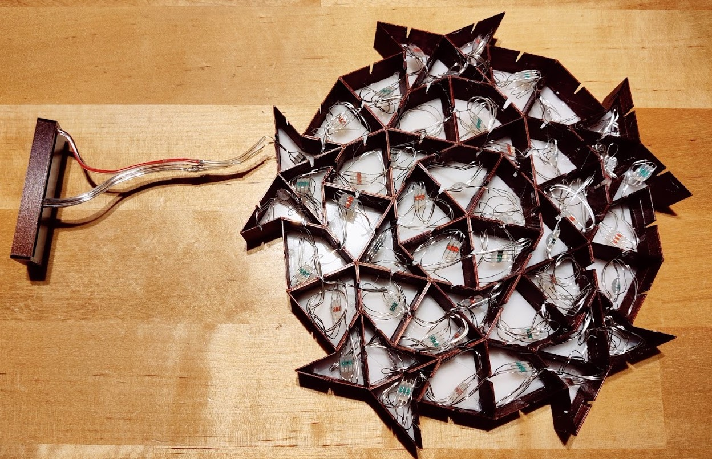
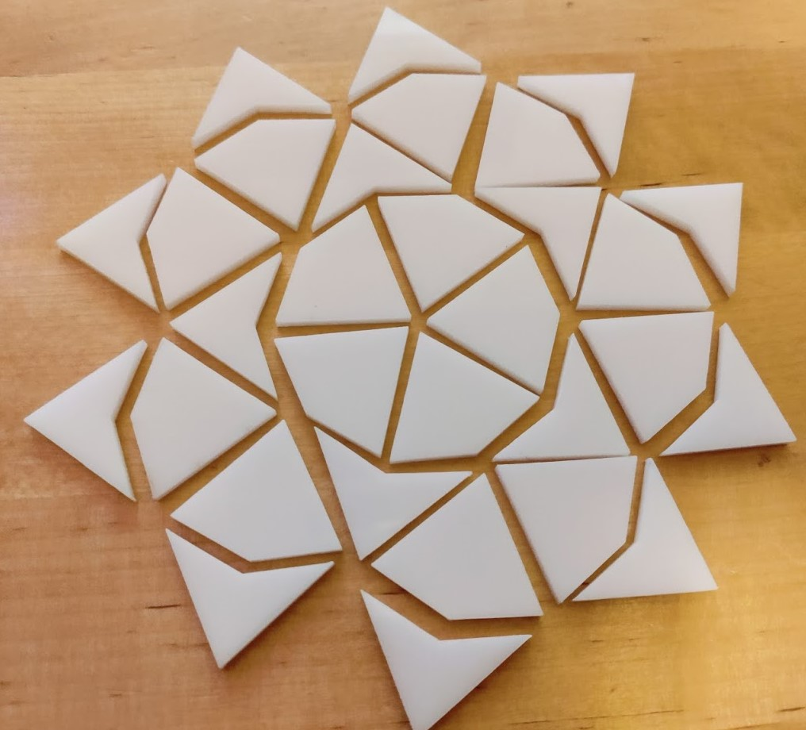
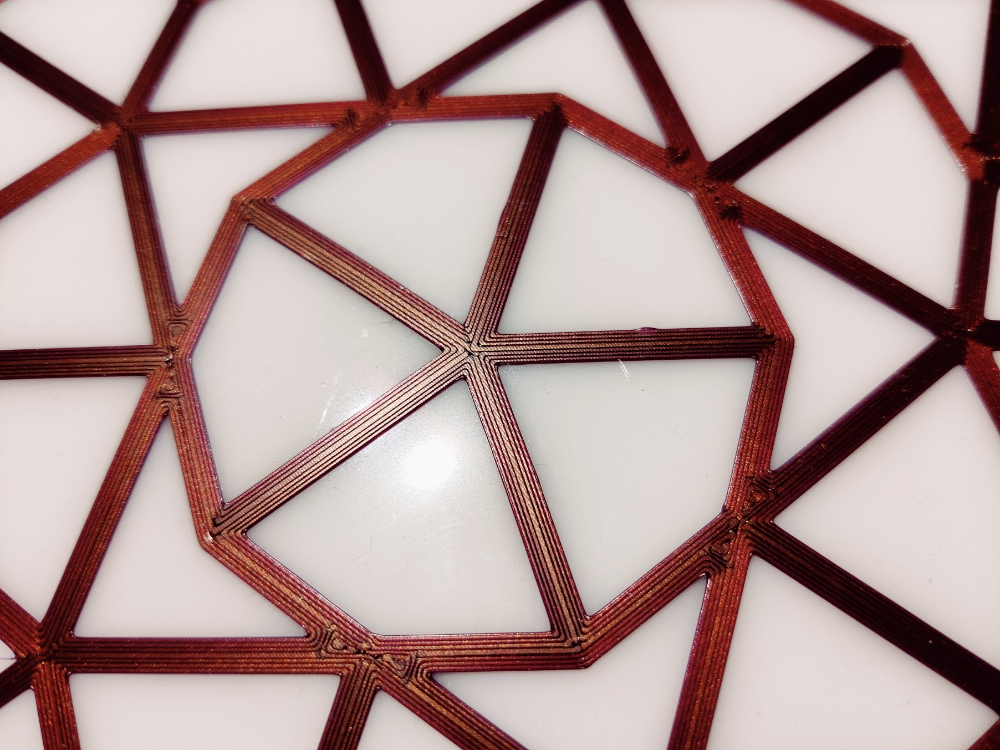
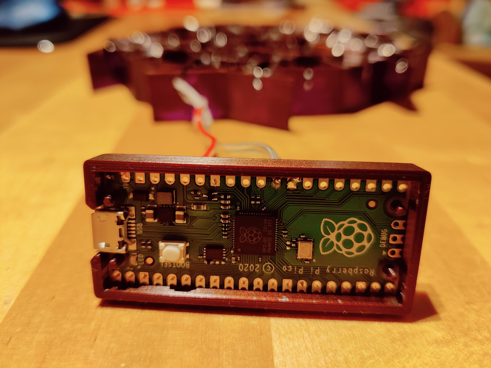

# pexel
Playing around with penrose tilings, in particular _P2_, which consists of _kites_ and _darts_

3D printed shapes, arranged in the _penrose sun_ pattern, LED back light through laser cut acryl with a Raspberry Pi Pico and MicroPython

20 darts and 25 kites, slowly changing their base color, giving a nice, non distracting back ground mood setting, looked a bit like church window style, in the end 

cycling through the color wheel every min (or so)

I built it just to explore the _very_ nice Penrose pattern and tinker a bit with 3D-CAD & MicroPython. I learnt a lot in the process

## Material

### scaffolding

Brown-purple filament (Prusament PLA Mystic Brown)

### backplane

currently open

### LEDs

WS2813 (45 LEDs, single LEDs, kind of cheap even with the traditional stripe, just wires) - they take up very little space in this package variant

### µController

Rasperry Pi Pico RP2040
USB cable

### case RP

housing for the RP: [Thingiverse Model](https://www.thingiverse.com/thing:4750920)

## Assembly

The acrylic pieces should snap in, but on some shaped the retention pins broke of, so I used a bit of hot glue. There are slits for the LED wires from one compartment to the next

## Code

RP2040 WS2812 [demonstrator](https://core-electronics.com.au/tutorials/how-to-use-ws2812b-rgb-leds-with-raspberry-pi-pico.html) code, modified to the number of LEDs and the pattern I wanted

## Kites and Darts

generated with Inkscape to reflect a [Pythagorean tiling](https://en.wikipedia.org/wiki/Pythagorean_tiling) - Its just lines, rotated by 144° or 72° as needed

laser cut white semi transparent acrylic 

## Scaffolding

generated with Fusion360, design was a bit challenging for me but in general nothing too complex

Interesting part is the 3D Printing part:

* activate thin wall detection in Prusa Slicer
* one can get a nice front side effect by increasing the number of perimeter lines to 4 or 5, so the window bridges are all parallel 

I printed a lot of discarded versions during the design phase (see evolution image above)

## Assembly

Solder 3 wires to the RPi, pin 22, gnd and 5V

